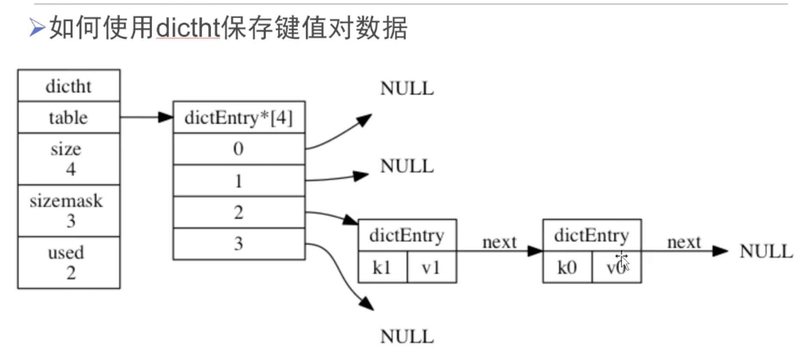

#Redis数据库

###NoSQL

- 泛指非关系型的数据库
- 不支持SQL语法
- 存储结构跟传统关系型数据库中的那种关系表完全不同，nosql中存储的数据都是KV形式
- NoSQL的世界中没有一种通用的语言，每种nosql数据库都有自己的api和语法，以及擅长的业务场景
- NoSQL中的产品种类相当多：
  - Redis
  - Mongodb
  - Hbase hadoop
  - Cassandra hadoop

###NoSQL和SQL数据库的比较

- 适用场景不同：sql数据库适合用于关系特别复杂的数据查询场景，nosql反之
- **事务** 特性的支持：sql对事务的支持非常完善，而nosql基本不支持事务
- 两者在不断地取长补短，呈现融合趋势

###Redis简介

- Redis是一个开源的使用ANSI C语言编写、支持网络、可基于内存亦可**持久化的日志型**、**Key-Value**数据库，并提供多种语言的API。
- Redis是 NoSQL技术阵营中的一员，它通过多种键值数据类型来适应不同场景下的存储需求，借助一些高层级的接口使用其可以胜任，如缓存、队列系统的不同角色

###Redis特性

- Redis支持数据的持久化，可以将内存中的数据保存在磁盘中，重启的时候可以再次加载进行使用。
- Redis不仅仅支持简单的key-value类型的数据，同时还提供list，set，zset，hash等数据结构的存储。
- Redis支持数据的备份，即master-slave集群模式的数据备份。
- 内存形的数据库，内存容量有限。
- **使用的是epoll，单进程单线程**

###Redis 优势

- 性能极高，读写速度极快 。
- 丰富的数据类型 – Redis支持二进制案例的 Strings, Lists, Hashes, Sets 及 Ordered Sets 数据类型操作。
- 原子 – Redis的所有操作都是原子性的，要么成功要么不成功。
- 丰富的特性 – Redis还支持 publish/subscribe, 通知, key 过期等等特性。
- 官方给出的读写速度是10万左右。

###Redis应用场景

- 用来做缓存(ehcache/memcached)——redis的所有数据是放在内存中的（内存数据库）
- 可以在某些特定应用场景下替代传统数据库——比如社交类的应用，减少update数据库的操作（验证码）
- 在一些大型系统中，巧妙地实现一些特定的功能：session共享、购物车

### Redis为什么这么快

redis的瓶颈不在与cpu的运行速度，而是在于带宽和内存的大小，所以使用单线程。

- 采用了多路复用的epoll
- 数据结构简单，操作节省时间
- 运行在内存中，速度快

### redis安装

####1.安装

首先保证电脑上有brew然后使用下面的命令安装即可

```shell
brew install redis
```

####2.常用命令

1.启动redis服务

```shell
redis-server
```

2.关闭redis服务

```shell
ps aux | grep redis
kill pid
```

3.客户端连接

```shell
redis-cli
redis-cli --raw # 解决中文乱码
```

4.开机启动redis命令

```shell
ln -sfv /usr/local/opt/redis/*.plist ~/Library/LaunchAgents
```

**5.使用配置文件启动redis-server**

```shell
redis-server /usr/local/etc/redis.conf
# 查看redis服务
ps aux | grep redis
```

8.停止redis服务

```shell
redis-cli shutdown
```

9.redis配置文件位置

```shell
/usr/local/etc/redis.conf
```

9.卸载redis

```shell
brew uninstall redis rm ~/Library/LaunchAgents/homebrew.mxcl.redis.plist
```

10.允许远程访问

```shell
vim /usr/local/etc/redis.conf
```

注释bind，默认情况下 redis不允许远程访问，只允许本机访问。

```shell
#bind 127.0.0.1
```

### 配置redis.conf

- 绑定ip：如果需要远程访问，可将此⾏注释，或绑定⼀个真实ip

  bind 127.0.0.1

- 端⼝，默认为6379

  port 6379

- 是否以守护进程运⾏

  - 如果以守护进程运⾏，则不会在命令⾏阻塞，类似于服务
  - 如果以⾮守护进程运⾏，则当前终端被阻塞
  - 设置为yes表示守护进程，设置为no表示⾮守护进程
  - 推荐设置为yes

  daemonize yes

- 数据⽂件

  dbfilename dump.rdb

- 数据⽂件存储路径

  dir /var/lib/redis

- ⽇志⽂件

  logfile "/var/log/redis/redis-server.log"

- 数据库，默认有16个

  database 16

- 主从复制，类似于双机备份。

  slaveof

###客户端命令

1.连接redis
	redis-cli

2.切换数据库
	select 10
	数据库没有名称，默认有16个，通过0-15来标识，连接redis默认选择第一个数据库

3.查看当前数据库的key-val数量

```
dbsize
```

4.请求数据库

```
flushdb # 清空当前数据库
flushall # 清空redis16个数据库
```

###数据结构

- redis是key-value的数据结构，每条数据都是⼀个键值对
- 键的类型是字符串
- 注意：键不能重复
- 值的类型分为五种：
  - 字符串string
  - 哈希hash
  - 列表list
  - 集合set 是无序的
  - 有序集合zset

###string类型

string的一个key对应一个value

value的最大是512M

####1.保存（增加）

- 设置键值

  ```sql
  set key value
  ```

  例1：设置键为`name`值为`itcast`的数据

  ```sql
  set name itcast
  ```

- 设置键值及过期时间，以秒为单位

  ```sql
  setex key seconds value
  ```

  例2：设置键为`aa`值为 bb 过期时间为3秒的数据

  ```sql
  setex aa 3 bb
  ttl aa // 查看aa的有效期
  ```

- 设置多个键值

  ```sq
  mset key1 value1 key2 value2 ...
  ```

  例3：设置键为`a1`值为`python`、键为`a2`值为`java`、键为`a3`值为`c`

  ```sql
  mset a1 python a2 java a3 c
  ```

- 追加值

  ```sql
  append key value
  ```

  例4：向键为`a1`中追加值`haha`

  ```sql
  append a1 haha
  // pthonhaha
  ```

####2.获取

- 获取：根据键获取值，如果不存在此键则返回`nil`

  ```sql
  get key
  ```

  例5：获取键`name`的值

  ```sql
  get name
  ```

- 根据多个键获取多个值

  ```sql
  mget key1 key2 ...
  ```

  例6：获取键`a1、a2、a3`的值

  ```sql
  mget a1 a2 a3
  ```

####3.删除

```sql
del aa
del aa bb // 删除多个
```

#### 4.修改

重新set已存在的健就会修改

```
set key value
```

###键命令

- 查找键，参数⽀持正则表达式

  > keys pattern

  例1：查看所有键

  > keys *

  例2：查看名称中包含`a`的键

  > keys a*

- 判断键是否存在，如果存在返回`1`，不存在返回`0`

  > exists key1

  例3：判断键`a1`是否存在

  > exists a1

- 查看键对应的`value`的类型

  > type key

  例4：查看键`a1`的值类型，为redis⽀持的五种类型中的⼀种

  > type a1

- 删除键及对应的值

  > del key1 key2 ...

  例5：删除键`a2、a3`

  > del a2 a3

- 设置过期时间，以秒为单位

- 如果没有指定过期时间则⼀直存在，直到使⽤`DEL`移除

  > expire key seconds

  例6：设置键`a1`的过期时间为3秒

  > expire a1 3

- 查看有效时间，以秒为单位

  > ttl key

  例7：查看键`bb`的有效时间

  > ttl bb

###hash类型

- **hash**⽤于存储对象，对象的结构为属性、值
- **值**的类型为**string**

####1.增加、修改

- 设置单个属性，不存在新增，存在更新

  > hset key field value

  例1：设置键 `user`的属性`name`为`itheima`

  > hset user name itheima

- 设置多个属性

  > hmset key field1 value1 field2 value2 ...

  例2：设置键`u2`的属性`name`为`itcast`、属性`age`为`11`

  > hmset u2 name itcast age 11

####2.获取

- 获取指定键所有的属性

  > hkeys key

  例3：获取键u2的所有属性

  > hkeys u2

- 获取⼀个属性的值

  > hget key field

  例4：获取键`u2`属性`name`的值

  > hget u2 name

- 获取多个属性的值

  > hmget key field1 field2 ...

  例5：获取键`u2`属性`name`、`age`的值

  > hmget u2 name age

- 获取所有属性的值

  > hvals key

  例6：获取键`u2`所有属性的值

  > hvals u2
  
- 获取属性值的个数

  > hlen key

  ```sql
  127.0.0.1:6379> hlen user
  (integer) 1
  ```

- 获取属性和属性值

  > hgetall key

  ```sql
  127.0.0.1:6379> hgetall user
  1) "name"
  2) "tangyu"
  ```

- 判断是否存在值

  ```sql
  127.0.0.1:6379> hexists user name
  (integer) 1
  127.0.0.1:6379> hexists user namd
  (integer) 0
  ```

####3.删除

- **删除整个hash键及值，使⽤del命令**

  ```sql
  del key
  ```

- 删除属性，属性对应的值会被⼀起删除

  > hdel key field1 field2 ...

  例7：删除键`u2`的属性`age`

  > hdel u2 age

####可能出现的错误

> MISCONF Redis is configured to save RDB snapshots, but is currently not able to persist on disk. Commands that may modify the data set are disabled. Please check Redis logs for details about the error.
>
> Redis被配置为保存数据库快照，但它目前不能持久化到硬盘。用来修改集合数据的命令不能用

- 原因：
  - 强制关闭Redis快照导致不能持久化。
- 解决方案：
  - 运行config set stop-writes-on-bgsave-error no　命令后，关闭配置项stop-writes-on-bgsave-error解决该问题。

###list类型

- 列表的元素类型为string
- 按照**插⼊顺序排序**，可以重复数据
- 可以左右插入数据
- 一个键对应多个值
- 本质是一个**链表**

####1.增加

- 在左侧插⼊数据

  > lpush key value1 value2 ...

  例1：从键为`a1`的列表左侧加⼊数据`a 、 b 、c`

  > lpush a1 a b c

  ```sql
  127.0.0.1:6379> lrange a1 0 -1
  1) "c"
  2) "b"
  3) "a"
  ```

- 在右侧插⼊数据

  > rpush key value1 value2 ...

  例2：从键为`a1`的列表右侧加⼊数据`0、1`

  > rpush a1 0 1

- 在指定元素的前或后插⼊新元素

  > linsert key before或after 现有元素 新元素

  r例3：在键为`a1`的列表中元素`b`前加⼊`3`

  > linsert a1 before b 3

####2.获取

- 返回列表⾥指定范围内的元素

  - `start`、`stop`为元素的下标索引
  - 索引从左侧开始，第⼀个元素为0
  - 索引可以是负数，表示从尾部开始计数，如`-1`表示最后⼀个元素

  > lrange key start stop

  例4：获取键为`a1`的列表所有元素

  > lrange a1 0 -1
  
  ```sql
  127.0.0.1:6379> lrange history 0 -1
  1) "4"
  2) "3"
  3) "2"
  4) "1"
  ```

- lindex按照索引下标获取元素

  ```sql
  127.0.0.1:6379> lrange history 0 -1
  1) "4"
  2) "3"
  3) "2"
  4) "1"
  127.0.0.1:6379> lindex history 0
  "4"
  ```

- llen返回列表长度，list不存在返回0

  ```sql
  127.0.0.1:6379> llen aaa
  (integer) 0
  127.0.0.1:6379> llen history
  (integer) 4
  ```

####3.更新

- 索引从左侧开始，第⼀个元素为0

- 索引可以是负数，表示尾部开始计数，如`-1`表示最后⼀个元素

  > lset key index value

  例5：修改键为`a1`的列表中下标为`1`的元素值为`z`

  > lset a 1 z

####4.删除(移除)元素

- 删除指定元素，删除元素不存在不修改

  - 将列表中前`count`次出现的值为`value`的元素移除
  - count > 0: 从头往尾移除
  - count < 0: 从尾往头移除
  - count = 0: 移除所有

  > lrem key count value

  例6.1：向列表`a2`中加⼊元素`a、b、a、b、a、b`

  > lpush a2 a b a b a b

  例6.2：从`a2`列表右侧开始删除2个`b`

  > lrem a2 -2 b

  例6.3：查看列表`a2`的所有元素

  > lrange a2 0 -1

- 移除元素 lpop和rpop

```sql
127.0.0.1:6379> lrange a1 0 -1
1) "c"
2) "b"
3) "a"
127.0.0.1:6379> lpop a1
"c"
127.0.0.1:6379> lrange a1 0 -1
1) "b"
2) "a"
127.0.0.1:6379> rpop a1
"a"
127.0.0.1:6379> lrange a1 0 -1
1) "b"
```

- 删除列表

  ```sql
  del a1
  ```

###set类型

- **⽆序集合**
- 元素为string类型
- 元素具有唯⼀性，不重复
- 说明：对于集合没有修改操作，只能删除重新创建，可以增加

####1.增加

- 添加元素

  > sadd key member1 member2 ...

  例1：向键`a3`的集合中添加元素`zhangsan`、`lisi`、`wangwu`

  > sadd a3 zhangsan sili wangwu

####2.获取

- 返回所有的元素

  > smembers key

  例2：获取键`a3`的集合中所有元素

  > smembers a3
  
  ```sql
  127.0.0.1:6379> smembers a3
  1) "zhangsan"
  2) "ty"
  3) "wangwu"
  4) "lisi"
  ```

- 判断集合中是否存在元素，存在返回1

  ```sql
  127.0.0.1:6379> sismember a3 qwe
  (integer) 0
  127.0.0.1:6379> sismember a3 ty
  (integer) 1
  ```

####3.删除

- 删除指定元素

  > srem key

  例3：删除键`a3`的集合中元素`wangwu`

  > srem a3 wangwu

###zset类型

- sorted set，有序集合
- 元素为string类型
- 元素具有唯⼀性，不重复
- 每个元素都会关联⼀个double类型的score，表示权重，通过权重将元素从⼩到⼤排序
- 说明：没有修改操作，可以增加

####1.增加

- 添加

  > zadd key score1 member1 score2 member2 ...

  例1：向键`a4`的集合中添加元素`lisi`、`wangwu`、`zhaoliu`、`zhangsan`，权重分别为`4、5、6、3`

  > zadd a4 4 lisi 5 wangwu 6 zhaoliu 3 zhangsan

####2.获取(类似列表)

- 返回指定范围内的元素

- start、stop为元素的下标索引

- 索引从左侧开始，第⼀个元素为0

- 索引可以是负数，表示从尾部开始计数，如`-1`表示最后⼀个元素

  > zrange key start stop

  例2：获取键`a4`的集合中所有元素

  > zrange a4 0 -1

- 返回`score`值在`min`和`max`之间的成员

  > zrangebyscore key min max

  例3：获取键`a4`的集合中权限值在`5和6之间`的成员

  > zrangebyscore a4 5 6

- 返回成员`member`的`score`值

  > zscore key member

  例4：获取键`a4`的集合中元素`zhangsan`的权重

  > zscore a4 zhangsan

####3.删除

- 删除指定元素

  > zrem key member1 member2 ...

  例5：删除集合`a4`中元素`zhangsan`

  > zrem a4 zhangsan

- 删除权重在指定范围的元素

  > zremrangebyscore key min max

  例6：删除集合`a4`中权限在`5、6之间`的元素 包括5和6

  > zremrangebyscore a4 5 6

###与python交互

#### 1.安装

```bash
pip install redis
```

#### 2.示例

```python
from redis import StrictRedis
# sr = StrictRedis(host='localhost', port=6379, db=0)

# 简写
sr=StrictRedis()
```

1.string-增加

- ⽅法set，添加键、值，如果添加成功则返回True，如果添加失败则返回False

```python
from redis import StrictRedis
if __name__=="__main__":
    try:
        #创建StrictRedis对象，与redis服务器建⽴连接
        sr=StrictRedis()
        #添加键name，值为itheima
        result=sr.set('name','itheima')
        #输出响应结果，如果添加成功则返回True，否则返回False
        print(result)
    except Exception as e:
        print(e)
```

2.string-获取

- ⽅法get，添加键对应的值，如果键存在则返回对应的值，如果键不存在则返回None

```python
from redis import StrictRedis
if __name__=="__main__":
    try:
        #创建StrictRedis对象，与redis服务器建⽴连接
        sr=StrictRedis()
        #获取键name的值
        result = sr.get('name')
        #输出键的值，如果键不存在则返回None
        print(result)
    except Exception as e:
        print(e)
```

3.string-修改

- ⽅法set，如果键已经存在则进⾏修改，如果键不存在则进⾏添加

```python
from redis import StrictRedis
if __name__=="__main__":
    try:
        #创建StrictRedis对象，与redis服务器建⽴连接
        sr=StrictRedis()
        #设置键name的值，如果键已经存在则进⾏修改，如果键不存在则进⾏添加
        result = sr.set('name','itcast')
        #输出响应结果，如果操作成功则返回True，否则返回False
        print(result)
    except Exception as e:
        print(e)
```

4.string-删除

- ⽅法delete，删除键及对应的值，如果删除成功则返回受影响的键数，否则则返 回0

```python
from redis import StrictRedis
if __name__=="__main__":
    try:
        #创建StrictRedis对象，与redis服务器建⽴连接
        sr=StrictRedis()
        #设置键name的值，如果键已经存在则进⾏修改，如果键不存在则进⾏添加
        result = sr.delete('name')
        #输出响应结果，如果删除成功则返回受影响的键数，否则则返回0
        print(result)
    except Exception as e:
        print(e)
```

5.获取键

- ⽅法keys，根据正则表达式获取键

```python
from redis import StrictRedis
if __name__=="__main__":
    try:
        #创建StrictRedis对象，与redis服务器建⽴连接
        sr=StrictRedis()
        #获取所有的键
        result=sr.keys()
        #输出响应结果，所有的键构成⼀个列表，如果没有键则返回空列表
        print(result)
    except Exception as e:
        print(e)
```

### 参考文档

file:///Users/yutang/Documents/黑马python资料/阶段4-web开发/课件/1-redis数据库/redis

b站视频：https://www.bilibili.com/video/BV1of4y197kq?p=599&t=195

### redis持久化

#### 1.rdb

redis默认采用持久化方式

定时往磁盘写入radis数据的rdb文件，时间可以设置。
相当于快照。
60秒内有1w个key读或者写的操作就会进行快照，但是如果处于临界值时断电，数据也会丢失。

如果发生故障，会丢失最后一次快照后的数据

####2.aof

相当于日志的形式，把操作命令写进日志中（磁盘中）。
每隔一秒钟就把命令同步到日志中。（可设置）
每执行一个命令，就把命令同步到日志文件中。
对数据不能丢失要求强。

rdb和aof可以一起使用，aof的优先级高。aof数据会比较安全，丢失数据少。

### 缓存穿透

就是客户持续向服务器发起对不存在服务器中数据的请求。客户先在Redis中查询，查询不到后去数据库中查询。

### 缓存击穿

就是一个很热门的数据，突然失效，大量请求到服务器数据库中。通常指一条数据。

缓存击穿是指缓存中没有但数据库中有的数据（一般是缓存时间到期），这时由于并发用户特别多，同时读缓存没读到数据，又同时去数据库去取数据，引起数据库压力瞬间增大，造成过大压力

### 缓存雪崩

就是大量数据同一时间失效。缓存中数据大批量到过期时间，而查询数据量巨大，引起数据库压力过大。

打个比方，你是个很有钱的人，开满了百度云，腾讯视频各种杂七杂八的会员，但是你就是没有netflix的会员，然后你把这些账号和密码发布到一个你自己做的网站上，然后你有一个朋友每过十秒钟就查询你的网站，发现你的网站没有Netflix的会员后打电话向你要。你就相当于是个数据库，网站就是Redis。这就是缓存穿透。
大家都喜欢看腾讯视频上的《水果传》，但是你的会员突然到期了，大家在你的网站上看不到腾讯视频的账号，纷纷打电话向你询问，这就是缓存击穿。
你的各种会员突然同一时间都失效了，那这就是缓存雪崩了。

缓存穿透
1.接口层增加校验，对传参进行个校验，比如说我们的id是从1开始的，那么id<=0的直接拦截；

2.缓存中取不到的数据，在数据库中也没有取到，这时可以将key-value对写为key-null，这样可以防止攻击用户反复用同一个id暴力攻击

缓存击穿
最好的办法就是设置热点数据永不过期，拿到刚才的比方里，那就是你买腾讯一个永久会员

缓存雪崩
1.缓存数据的过期时间设置随机，防止同一时间大量数据过期现象发生。
2.如果缓存数据库是分布式部署，将热点数据均匀分布在不同的缓存数据库中。
3.设置热点数据永不过期

### Redis字典的实现

哈希表



